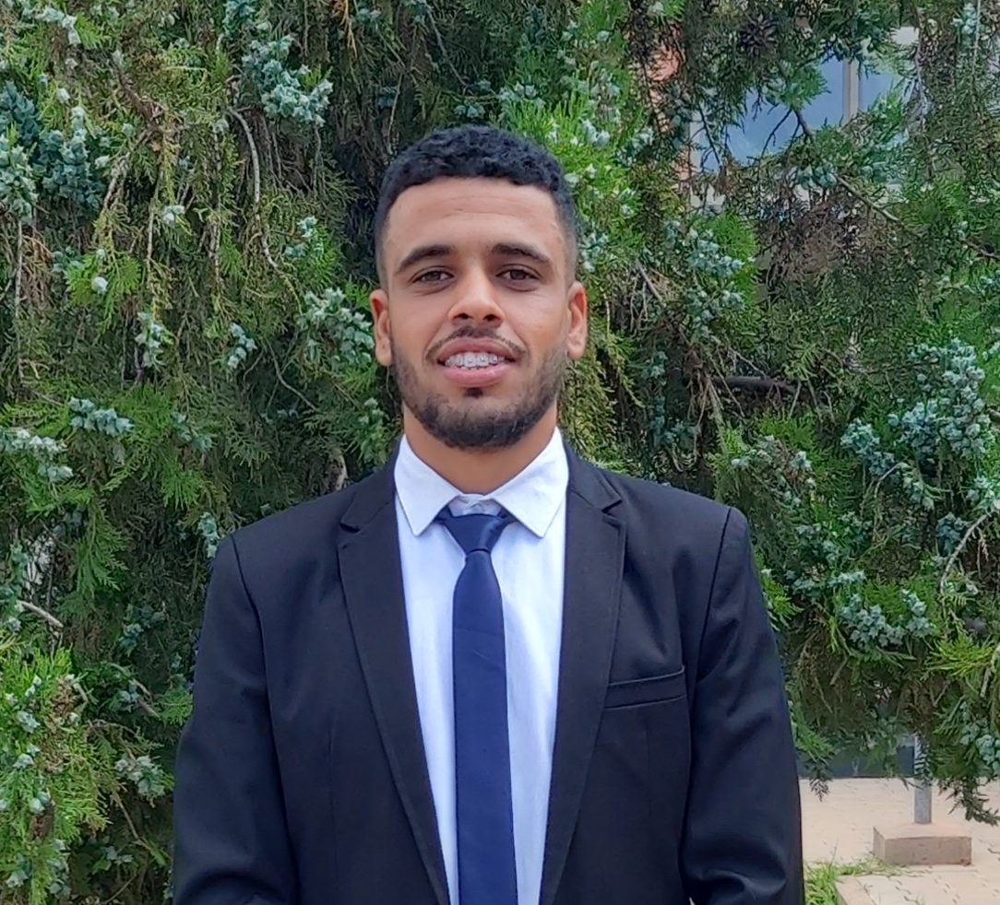

---
hide:
  - navigation
  - toc
title: About
---

<link rel="stylesheet" href="../../stylesheets/home/about.css">

  

    

     

     

      <h1>MOUHIHA Mohamed</h1>
      <h2>Morocco, Eljadida</h2>
      <h3>Data Engineer | Data Analyst  | Data Scientist | Full-stack developer @Angular, @Java & @Python<h3>
      

       <a href="https://www.linkedin.com/in/mouhiha-mohamed-a0657b1a3/" class="ln" style=" color: inherit;" title="Linked In - MOUHIHA Mohamed"><i class="fab fa-linkedin"></i></a>
       <a href="https://github.com/mouhihaMohamed702" class="git" style=" color: inherit;" title="Github - MOUHIHA Mohamed"><i class="fab fa-github"></i></a>
       <a href="https://www.instagram.com/" class="insta" style=" color: inherit;" title="Instagram - MOUHIHA Mohamed"><i class="fa fa-instagram"></i></a>
       <a href="https://twitter.com" class="twitter" style=" color: inherit;" title="Twitter - @mouhiha mohamed"><i class="fa fa-twitter"></i></a>
       <a href="https://web.facebook.com//" class="ln" style=" color: inherit;" title="Facebook -mouhiha mohamed"><i class="fab fa-facebook"></i></a>
       <a href="https://www.spotify.com" class="spotify" style=" color: inherit;" title="Spotify - mouhiha mohamed"><i class="fab fa-spotify"></i></a>
       <a href="mailto:<mouhihamohamed@gmail.com>" class="email" style=" color: inherit;" title="Email - mouhihamohamed@gmail.com"><i class="fas fa-paper-plane"></i></a>
      

      <a href="https://www.buymeacoffee.com" style=" color: inherit;">
        <button class="coffeelarge" title="Buy Me a Coffee :)"><i class="fas fa-coffee"></i> Buy Me a Coffee</button>
        <button class="coffeesmall" title="Buy Me a Coffee :)"><i class="fas fa-coffee"></i></button>
      </a>
     

    

  

  

    

     <a href="https://drive.google.com/file/d/17guhLbNYMGDpqxXlxAy_PILrZZ6hwk_N/view?usp=sharing"><strong>Export Resume </strong><i class="far fa-file-alt"></i>
     </a><h1>About</h1>
      

      
<strong>Hey! I’m MOUHIHA Mohamed,</strong> I'm a 23-year-old Moroccan who graduated with a Master's degree in Big Data, Data Science, Machine Learning, Deep Learning, Business Intelligence and Computer Vision at National School of Applied Sciences of Khouribga.
      My passion for data science stems from my belief in the power of technology to drive positive change. I'm fascinated by how data can be used to solve complex problems and improve people's lives. I also believe that hard work and dedication are essential to success. As the famous author <i>Stephen King</i> once said, " <strong>Talent is cheaper than table salt. What separates the talented individual from the successful one is a lot of hard work.</strong>"

     <h2><i class="fas fa-briefcase"></i> Experience -</h2>
     
<strong>Research StudentJan 2023 - Jun 2023 <a href="https://www.linkedin.com/company/lipim/about/">Laboratory of Process Engineering, Computer Science and Mathematics at ENSA-Kh </a></strong> - Internship

Master's thesis project: Analysis and comparison of deep learning recommender systems.
      <ul>
<li>Discover recommendation systems and the recommendation process;
<li>Discover the 3 filtering approaches;
<li>Evaluation of recommendation systems;
<li>Conduct a literature review on the different classes of deep learning methods used in recommendation systems (MLP, AE, CNN, and RNN);
<li>Convert explicit feedback data into an implicit feedback dataset;
<li>Propose an MLP architecture;
<li>  Compare our proposed approach with existing methods;
 <li>  Our method surpasses the state-of-the-art method.
      </ul>
      
<strong>Full stack developer Apr 2021 -Jun 2021 <a href="https://www.linkedin.com/company/ziryabtec/">Ziryab Tec </strong></a> - Internship

      
Design and development of a web application for managing recruitment files online using laravel/Angular/MySql

      
<strong>Full stack developerApr 2020 - Jun 2020 <a href="https://www.ucd.ac.ma/universite/etablissements/ecole-superieure-de-technologie/">Higher School of Technology</strong></a> - Internship

      

       Design and development of a trainee management web applica- tion with Php5/html/css/Bootsrap/Jquery/JavaScript/MySql
      

      
<strong>Full stack developerJul 2019-Aug 2019 <a href="https://www.linkedin.com/company/atlanta-group-uk/">Atlanta Insurance </strong></a> - Internship

      

      Design and development of a web application for managing re- cruitment files online using C#/MySql
      

     <h2><i class="fas fa-graduation-cap"></i> Education -</h2>
      
<strong>Research Master in Big Data and Decision SupportSep 2021 - Jun 2023 <a href="https://ensak.usms.ac.ma/ensak/">Khouribga National School of Applied Sciences</a></strong> Morocco, Khouribga

 

      
<strong>Bachelor Degree in Computer Science and Applied Mathematics option Computer ScienceSep 2020 - Apr 2021 <a href="https://www.ucd.ac.ma/universite/etablissements/">Sidi Bennour Polydisciplinary Faculty </a></strong> Morocco, El Jadida

      
<strong>University Diploma of Technology (DUT) in Computer EngineeringSep 2018 - Apr 2020 <a href="https://www.ucd.ac.ma/universite/etablissements/ecole-superieure-de-technologie/">Sidi Bennour Higher School of Technology  </a></strong> Morocco, El Jadida

     <h2><i class="fas fa-award"></i> Honors & Awards -</h2>
     
<strong><a href="https://e.huawei.com/en/talent/ict-academy/">Coursera</a>,  Python for Data Science, AI Development (<a href="https://www.coursera.org/account/accomplishments/certificate/2DGWV2FLUKNS">Certification</a>)Jul 2023 </strong>

 

<strong><a href="https://e.huawei.com/en/talent/ict-academy/">Coursera</a>,  Introduction to Java (<a href="https://www.coursera.org/account/accomplishments/certificate/NXL4JQFNGH5P">Certification</a>)Jul 2023 </strong>

 

     
<strong><a href="https://e.huawei.com/en/talent/ict-academy/">Coursera</a>,  Getting Started with Data Warehousing and BI Analytics (<a href="https://www.coursera.org/account/accomplishments/certificate/7DPL4KS55SQ9">Certification</a>)Jun 2023 </strong>

 

      
<strong><a href="https://e.huawei.com/en/talent/ict-academy/">Huawei ICT Academy</a>,  HCIA - Big Data (<a href="https://drive.google.com/file/d/1hQHTRE65Q00n121vAA8YzjF8xVZJR8uL/view">Certification</a>)Mar 2020  <a href="https://www.ucd.ac.ma/">UCD Université Chouaib Doukkali</a></strong> Morocco, El Jadida

 

      
<strong>Hackathon - ENSA El Jadida, 2nd Place Apr 2019  <a href="https://www.ensaj.ucd.ac.ma/">ENSA El Jadida</a></strong> Morocco, El Jadida

 

     <h2><i class="fas fa-map-marker-alt"></i> Where I'm Located -</h2>
      

        <iframe width="100%" height="350" style="margin-bottom: 12px; border:0 " loading="lazy" allowfullscreen src="https://www.google.com/maps/embed?pb=!1m18!1m12!1m3!1d1361.5948895595536!2d-8.507329883840927!3d33.245581780820854!2m3!1f0!2f0!3f0!3m2!1i1024!2i768!4f13.1!3m3!1m2!1s0xdaf1a69db96d39b%3A0xc37626dfc33ad1a3!2sEl%20Jadida%2C%20Morocco!5e0!3m2!1sen!2s!4v1621635093506!5m2!1sen!2s"></iframe> 
      

     <h2><i class="fas fa-city"></i> Community Involvement -</h2>
      
<strong><a href="https://web.facebook.com/Rotaract.ENSAKH/?_rdc=1&_rdr">Rotaract Association</a>, Active memberAug 2020 - July 2021 <a href="https://ensak.usms.ac.ma/ensak/">Khouribga National School of Applied Sciences</a></strong> Morocco, Khouribga

 

      
<strong><a href="https://www.linkedin.com/company/enactus-ensa-khouribga/">Enactus Association</a>, Active memberSep 2021 - Jan 2023 <a href="https://ensak.usms.ac.ma/ensak/">Khouribga National School of Applied Sciences</a></strong> Morocco, Khouribga

 
 
      

     <h2><i class="fas fa-headphones-alt"></i> What I'm Listening To -</h2>
      

       
    

  

